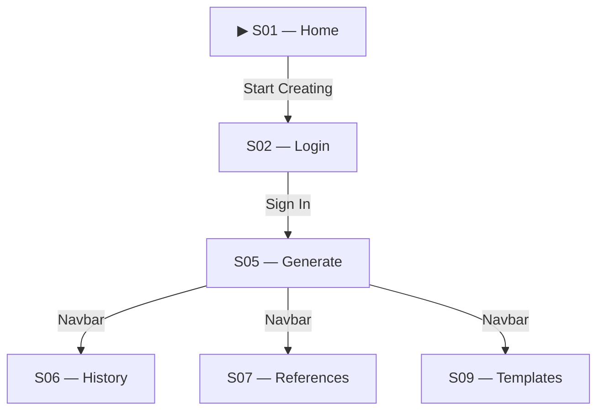

# InstaCover — GUI/UX Dokumentáció

Ez a mappa tartalmazza az InstaCover alkalmazás felhasználói felületének és felhasználói élményének dokumentációját.

## Tartalomjegyzék

| Fájl | Leírás |
|------|--------|
| [pageflow.png](./pageflow.png) | Képernyő-térkép: az összes képernyő és a köztük lévő navigáció vizuálisan |
| [pageflow.mmd](./pageflow.mmd) | Szerkeszthető Mermaid forrásfájl a képernyő-térképhez |
| [screens.csv](./screens.csv) | Képernyő-leírás táblázat minden képernyő részletes leírásával |
| [journeys.md](./journeys.md) | Top 3 felhasználói út lépésről lépésre |
| [design_system.md](./design_system.md) | Design rendszer dokumentáció (színek, tipográfia, spacing, komponensek) |
| [self_assessment.md](./self_assessment.md) | Önértékelés 1-5 skálán + szabadszöveges reflexió |
| [screenshots/](./screenshots/) | Képernyőképek minden egyedi képernyőről |

## Képernyők áttekintése

| ID | Név | Auth szükséges |
|----|-----|----------------|
| S01 | Home | Nem |
| S02 | Login/Register | Nem |
| S03 | Forgot Password | Nem |
| S04 | Reset Password | Nem |
| S05 | Generate | Igen |
| S06 | History | Igen |
| S07 | Style References | Igen |
| S08 | Auth Callback | Nem |
| S09 | Templates | Igen |

## Pageflow előnézet



A teljes diagram a [pageflow.png](./pageflow.png) fájlban található.

## Screenshots mappa struktúra

A screenshots mappába a következő fájlokat kell elhelyezni:

```
screenshots/
├── S01_home.png
├── S02_login.png
├── S02_register.png
├── S03_forgot_password.png
├── S04_reset_password.png
├── S05_generate_idle.png
├── S05_generate_generating.png
├── S05_generate_completed.png
├── S06_history.png
├── S06_history_empty.png
├── S07_style_references.png
├── S07_style_references_empty.png
├── S08_auth_callback.png
└── S09_templates.png
```

Opcionálisan dark mode verziók is hozzáadhatók `_dark.png` szuffixummal.

## Főbb felhasználói utak

1. **Első borító generálása** — Új felhasználó regisztrál és elkészíti az első borítóját
2. **Stílusreferencia használata** — Meglévő borító alapján konzisztens sorozat készítése
3. **Sablon-alapú generálás** — Egyedi tipográfiai sablon létrehozása és használata

Részletek: [journeys.md](./journeys.md)

## Design alapelvek

- **Minimalizmus** — Tiszta, fehér felületek, kevés vizuális zaj
- **Valós idejű visszajelzés** — WebSocket-alapú progress minden hosszú művelethez
- **Reszponzivitás** — Mobile-first megközelítés, 5 breakpoint
- **Dark mode** — Teljes sötét téma támogatás

Részletek: [design_system.md](./design_system.md)

## Technológiák

- React 19 + TypeScript
- TailwindCSS v4
- Framer Motion
- Heroicons
- Socket.IO (valós idejű kommunikáció)

---

*Készült a szakdolgozati GUI/UX dokumentáció követelmények alapján.*
